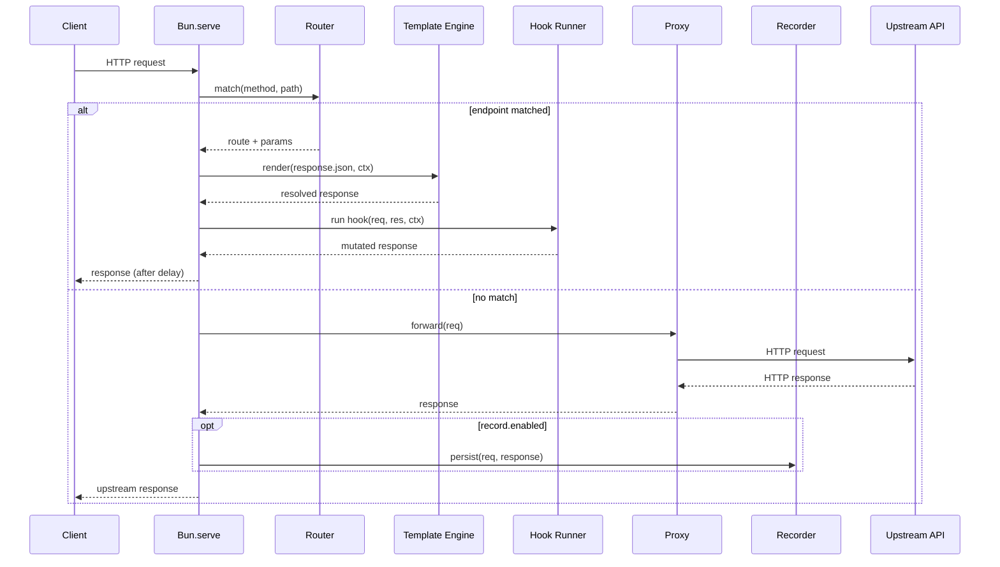

# 03 — Request Lifecycle

This document traces a single HTTP request from arrival to response.

## High-Level Flow



## Step-by-Step

### 1. Receive
`Bun.serve` accepts the connection. The raw `Request` is wrapped into an
internal `MockRequest` (lazy body parsing).

### 2. Match (see [`07-routing.md`](07-routing.md))
The router checks the precomputed route table. Match keys: `method` + path
segments. Static folders beat `_param` folders (D-003). On match, dynamic
segments populate `req.params`.

### 3. Load `response.json`
The matched method block is extracted. Defaults applied:

| Field   | Default              |
|---------|----------------------|
| status  | `200`                |
| headers | `{}`                 |
| body    | `{}`                 |
| delay   | `0`                  |

### 4. Render Templates (see [`04-templating.md`](04-templating.md))
The body and header values are walked. `{{ ... }}` tokens are resolved
against:

- `req.params`, `req.query`, `req.headers`, `req.body`
- Custom helpers from `helpers/`
- (Phase 2) read-only `db.*`

### 5. Run Hook (see [`05-hooks.md`](05-hooks.md))
If `hook.ts` exists in the matched folder, it is dynamically imported and
invoked:

```ts
await hook(req, res, ctx);
```

Hooks mutate `res.status`, `res.headers`, `res.body`, `res.delay`.

### 6. Apply Global Headers (D-019)
`mock.config.ts → globalHeaders` are merged into the response. Per-response
headers win on conflict.

### 7. Apply Delay
If `res.delay > 0`, await `Bun.sleep(res.delay)`.

### 8. Respond
Construct a `Response` from the resolved object and return it to Bun.

## Fall-Through (No Match)

### 9. Proxy (see [`08-proxy-and-recorder.md`](08-proxy-and-recorder.md))
The original request is forwarded to `baseUrl + path + query`. Headers are
preserved (minus hop-by-hop). Body is streamed.

### 10. Record (optional)
If `record.enabled`, the upstream response is filtered through `include` /
`exclude` rules. If allowed, a stub is persisted to `endpoints/<path>/`.

### 11. Return Upstream Response
Status, headers, and body stream back to the client unchanged.

## Error Boundaries

| Stage             | Failure Mode                              | Behavior                                |
|-------------------|-------------------------------------------|-----------------------------------------|
| Router            | No match                                  | Fall through to proxy                   |
| Template engine   | Unknown helper / invalid token            | 500 with diagnostic body                |
| Hook              | Uncaught throw / rejection                | 500 with diagnostic body                |
| Proxy             | Network error / timeout                   | 502 with diagnostic body                |
| Recorder          | Disk write failure                        | Log warning; do not fail the response   |

## The `ctx` Object (D-013)

A single context object is threaded through both templates and hooks. Phase
1 contains only `req`. Phase 2 adds `db`. Phase 3 adds nothing (checker is
out-of-band).

```ts
interface Ctx {
  req: MockRequest;
  // db: Db;          // Phase 2
}
```

## References

- D-003, D-013, D-019
- [`04-templating.md`](04-templating.md), [`05-hooks.md`](05-hooks.md),
  [`07-routing.md`](07-routing.md), [`08-proxy-and-recorder.md`](08-proxy-and-recorder.md)
