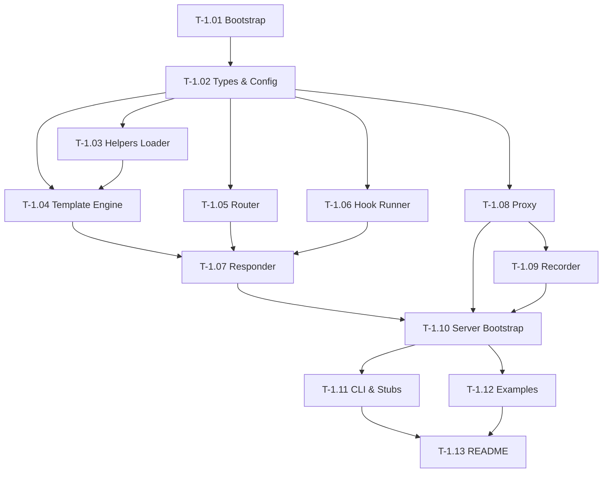
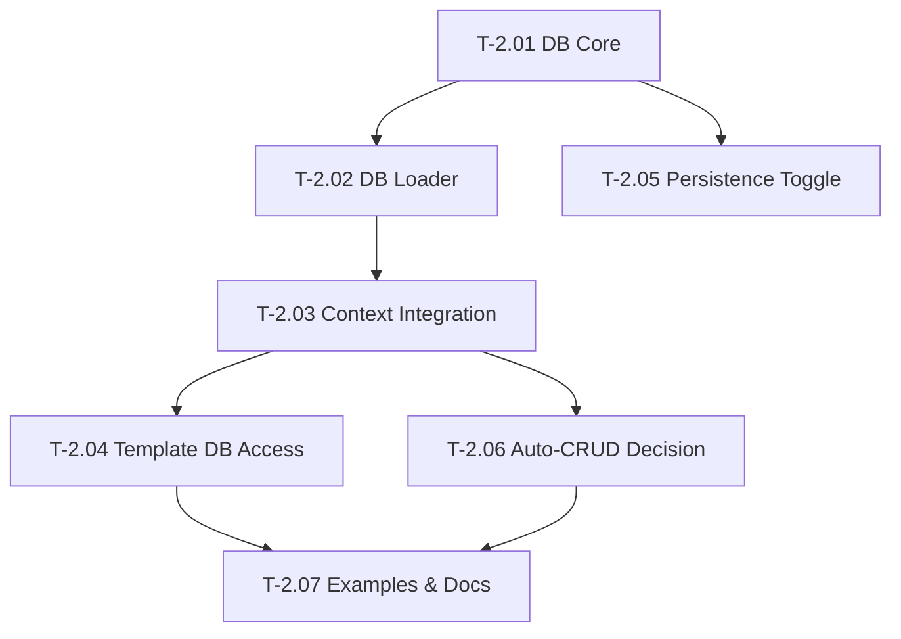
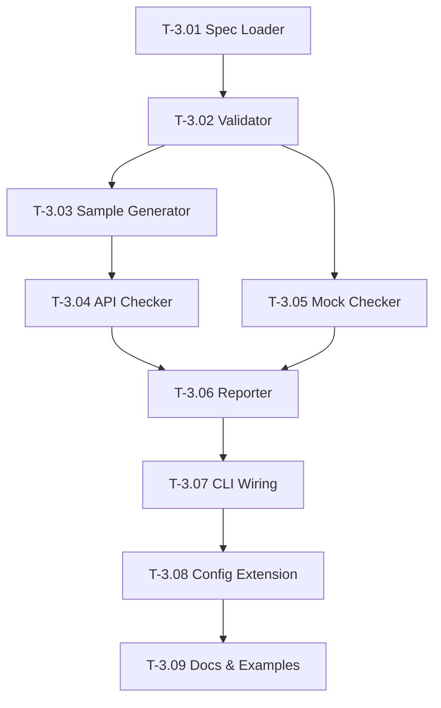

# Task Files

This folder contains all implementation tasks for Smocker, organized by
phase. Each file is self-contained and follows a uniform template
(see [Task File Template](#task-file-template) below).

## Identifier Scheme

```
T-<phase>.<NN>
```

For example, `T-1.04` is Phase 1, Task 04 — Template Engine.

## Phase Overview

| Phase | Theme                              | Tasks | Folder                  |
|-------|------------------------------------|-------|-------------------------|
| 1     | Mock server core                   | 13    | [`phase-1/`](phase-1/)  |
| 2     | Shared in-memory DB                | 7     | [`phase-2/`](phase-2/)  |
| 3     | OpenAPI checker (CLI)              | 9     | [`phase-3/`](phase-3/)  |

## Phase 1 Dependency Graph



## Phase 2 Dependency Graph

Prerequisite: Phase 1 complete.



## Phase 3 Dependency Graph

Prerequisite: Phase 1 complete (Phase 2 not required).



## Task File Template

Every task file uses the structure below.

```markdown
# Task <ID>: <Title>

## Status
- [ ] Not started

## Goal
One-sentence description.

## Context
Why this task exists, how it relates to other tasks.

## Inputs / Prerequisites
- Other tasks that must be complete first
- Architecture docs to read

## Deliverables
- Files created/modified with paths
- Public API additions/changes

## Implementation Notes
Step-by-step guidance, code shape examples, edge cases.

## Acceptance Criteria
- [ ] Verifiable outcomes

## Out of Scope
Explicit non-goals to prevent scope creep.

## References
Architecture docs and decision log entries.
```

## How to Pick a Task

1. Choose a phase that meets the prerequisites.
2. Pick the lowest-numbered task whose prerequisites are complete.
3. Read the referenced architecture docs first.
4. Confirm acceptance criteria before marking the task complete.

## Updating Status

Tick the `## Status` checkbox in the task file when complete:

```markdown
## Status
- [x] Complete (2026-MM-DD)
```
